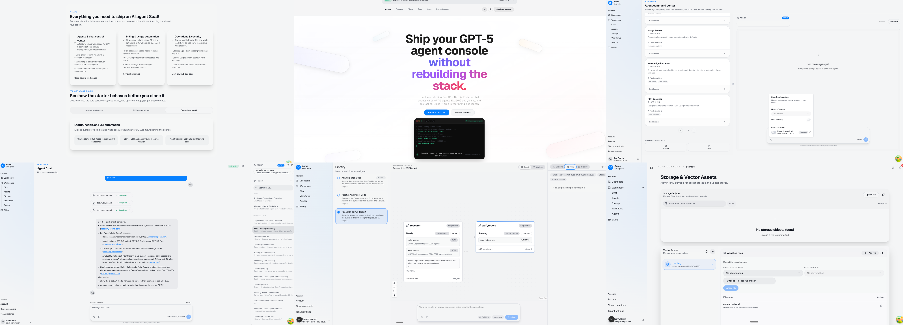

# OpenAI Agent Starter

Starter kit for building AI Agent SaaS products. The repo bundles a FastAPI backend (OpenAI Agents SDK v0.6.4) and a Next.js 16 frontend, plus an operator-focused Starter Console that wires secrets, infrastructure, and env files in one flow.



## Quick Start (choose one)

| Setup mode | Best for | Entry point |
| --- | --- | --- |
| Demo | Fast local demo | `just setup-demo-lite` (or `just setup-demo-full`) |
| Wizard | Dev/staging/production | `starter-console setup wizard --profile demo|staging|production` |
| Manual | Power users | Copy `.env` examples + run `just dev-up` / `just migrate` / `just api` (see “Guided Setup” below) |

### 1) Fast demo (local)
Best for a quick, runnable demo with sensible defaults.

```bash
just python-bootstrap
just dev-install
just setup-demo-lite
just api
```

Optional: `just setup-demo-full` for all automation toggles, and `just issue-demo-token` after the API is running.

### 2) Guided wizard (demo / staging / production)
Use this when you want something beyond a demo or need staging/production fidelity. Profiles: `demo` (local dev), `staging`, `production`.

```bash
starter-console setup wizard --profile demo
# or: --profile staging | --profile production
```

Headless/CI: `starter-console setup wizard --non-interactive --answers-file ./answers.json`.
Repo shortcuts: `just setup-staging` and `just setup-production`.
Alternate startup: `starter-console start dev --detached` (or `just start-dev`) after env files exist.

### 3) Just browse the repo
If you only want to read the code/docs, clone and explore:
`README.md`, `SNAPSHOT.md`, and `packages/starter_console/README.md`.

## Architecture At A Glance
- **Backend** (`apps/api-service/`): FastAPI, async SQLAlchemy, Postgres + Redis (refresh-token cache, rate limits, billing streams), Ed25519 JWT auth, Alembic migrations, OpenAI Agents SDK integrations, Stripe billing services.
- **Frontend** (`apps/web-app/`): Next.js 16 App Router with BFF routes under `app/api/v1`, TanStack Query, Shadcn UI, HeyAPI-generated client under `lib/api/client`, Storybook, Playwright/Vitest tests.
- **Starter Console** (`packages/starter_console/`): Operator workflows (setup wizard, secrets onboarding, Stripe provisioning, auth tooling, infra helpers) with side-effect-free imports so CI/CD can run `starter-console`.
- **Shared Contracts** (`packages/starter_contracts/`): Import-safe contracts for settings, secrets, storage, key management, provider validation, and structured logging shared by the backend and Starter Console.
- **Starter Providers** (`packages/starter_providers/`): Concrete SDK clients (AWS Secrets Manager, Azure Key Vault, Infisical) used by backend + console while keeping contracts dependency-light.
- **Docs & Trackers** (`docs/`): SDK references, frontend UI/data-access guides, console milestones, and project trackers.

## API Service Capabilities (FastAPI)
- **Agent specs (declarative)** — Specs live in `apps/api-service/src/app/agents/<key>/spec.py` with Jinja prompts (`prompt.md.j2`). Each spec defines tools, handoffs, outputs, memory defaults, guardrails, and vector-store bindings. Registries materialize specs into concrete OpenAI Agents at runtime.
- **Guardrails (safety + policy)** — Pluggable checks (moderation, jailbreak, PII, hallucination, prompt injection, URL filtering) with presets (`minimal`, `standard`, `strict`, plus tool presets). Agents can apply input/output guardrails and per-tool guardrails; runtime supports streaming or blocking evaluation.
- **Tools** — Explicit tool allowlists per agent. Hosted OpenAI tools (`web_search`, `file_search`, `code_interpreter`, `image_generation`) plus built-ins (`get_current_time`, `search_conversations`), custom function tools, and Hosted MCP tools configured via `MCP_TOOLS`.
- **Workflows** — Deterministic orchestration over agents via `WorkflowSpec` (`apps/api-service/src/app/workflows/<key>/spec.py`), supporting sequential and parallel stages with reducers; workflows reuse agent specs for prompts/tools/guardrails/memory.
- **Vector stores + File Search** — OpenAI Vector Stores integration with per-tenant stores, agent bindings, file attach/search, and request-level overrides. Agent specs choose `tenant_default`, `static`, or `required` bindings.
- **Containers (Code Interpreter)** — Per-tenant container management and agent bindings for OpenAI Code Interpreter. Supports explicit container IDs or auto-managed containers with configurable memory tiers and quotas.
- **Storage + assets** — Tenant-scoped object storage with presigned uploads/downloads, Postgres metadata, and guardrails for MIME/size. Generated assets are tracked separately and linked to conversations/messages.
- **Streaming** — Normalized SSE contract (`public_sse_v1`) for chat + workflow streams, including tool events, reasoning parts, and lifecycle markers for frontend rendering.
- **Auth + SaaS controls** — Ed25519 JWTs, refresh-token rotation, MFA, tenant context enforcement, signup policy (public/invite/approval), Stripe billing + usage guardrails.

## Hosting & Infrastructure Options
- **Compute/runtime** — FastAPI ASGI service + optional worker process. Supports single-instance or multi-replica deployments; billing retry/stream workers can run inline or as a dedicated deployment to avoid double-processing.
- **Datastores** — Postgres (durable state) and Redis (refresh tokens, rate limits, billing streams). Both are first-class in the console wizard and health probes.
- **Secrets providers** — Vault (dev/HCP), Infisical (cloud/self-host), AWS Secrets Manager, Azure Key Vault (all wired through the Starter Console).
- **Object storage providers** — In-memory (dev/test), MinIO/S3-compatible, AWS S3, Azure Blob, or Google Cloud Storage (GCS) with presigned upload/download flows.
- **Observability** — JSON logs to stdout or file sink; optional OTLP export via the bundled OpenTelemetry collector or external endpoints.
- **Local dev stack** — Docker Compose helpers for Postgres/Redis/Vault/OTel collector via `just dev-up` and console automation.
- **Reference blueprints** — Terraform reference deployments for AWS (ECS/Fargate) and Azure (Container Apps) under `ops/infra/` with guidance in `docs/ops/hosting-overview.md`.
- **Ops runbook** — Release, migrations, and rollback guidance in `docs/ops/runbook-release.md`.

> Default hosting posture: the AWS/Azure blueprints assume cloud‑native secrets (Secrets Manager on AWS,
> Key Vault on Azure). Vault/Infisical are optional enterprise paths and require explicit env wiring in
> Terraform (`api_env` / `api_secrets`).

## Repo Layout (current)
```
justfile                # root orchestrator
ops/                    # compose + observability generator
docs/                   # ADRs, guides, trackers
apps/
  api-service/          # FastAPI backend
  web-app/              # Next.js frontend
packages/
  starter_console/          # operator console
  starter_contracts/    # shared contracts
  starter_providers/    # shared cloud SDK clients
tools/                  # shared scripts (typecheck, smoke, moduleviz, vault helpers)
var/                    # runtime artifacts (keys, logs, reports) — gitignored
.env.compose(.example)  # docker compose defaults
apps/api-service/.env.local(.example)    # backend service secrets
pnpm-workspace.yaml     # JS/TS workspaces (apps/*, packages/*)
tsconfig.scripts.json   # TS config for repo scripts
```
See `docs/architecture/repo-layout.md` for rules and ownership. Hosting reference docs live in `docs/ops/hosting-overview.md`.

## Quick Command Map (Just)
- `just api` / `just migrate` / `just migration-revision "msg"` – backend serve + migrations (delegates to `apps/api-service/justfile`).
- `just backend-lint | backend-typecheck | backend-test` – backend quality gates.
- `just cli-lint | cli-typecheck | cli-test` – Starter Console quality gates.
- `just contracts-lint | contracts-typecheck | contracts-test` – contracts package gates.
- `just web-lint | web-typecheck | web-test` – frontend gates (run `pnpm install` first).
- `just dev-up | dev-down | dev-logs | dev-ps` – Postgres/Redis(+otel) via `ops/compose/docker-compose.yml`.
- `just vault-up | vault-down | verify-vault` – local Vault dev signer flows.
- `just cli cmd="..."` – run any console command; `just stripe-replay args="list --status failed"` for Stripe tooling.

## Prerequisites
| Tool | Version | Notes |
| --- | --- | --- |
| Python | 3.11+ | Recommended: install via `uv python install 3.11`. |
| Hatch | 1.16+ | Recommended: `uv tool install --python 3.11 hatch` (or `pipx install hatch`). |
| Node.js | 22+ | Paired with `pnpm` for the Next.js app. |
| pnpm | 10+ | `pnpm install` in `apps/web-app/` (repo pins `pnpm@10.15.0`). |
| just | Latest | Task runner replacing the old Makefile; install via `brew install just` or `sudo apt-get install just`. |
| Docker & Compose v2 | — | Used by Just recipes for Postgres/Redis/Vault. |
| Terraform | 1.14.x | Required for `ops/infra/*` reference blueprints (pinned in `.tool-versions`). |
| Stripe CLI | — | Required for `starter-console stripe setup` unless `--skip-stripe-cli`. |

> Tip: macOS users can run `brew install just`; Ubuntu runners can use `sudo apt-get install just`.

## Guided Setup (wizard details)
If you’re going beyond a demo, use the wizard so env files and audit artifacts stay consistent across environments. Profiles: `demo` (local dev), `staging`, `production`.

1. **Bootstrap tooling**
   ```bash
   just python-bootstrap   # installs Python 3.11 + Hatch (via uv)
   just bootstrap          # creates/refreshes the Hatch environment
   pnpm install            # inside apps/web-app/
   ```
2. **Create local compose defaults**
   ```bash
   cp .env.compose.example .env.compose
   ```
   `.env.compose` is gitignored and holds non-sensitive defaults for local helpers (ports, toggles, etc.).
3. **Run prerequisite check**
   ```bash
   just cli cmd="infra deps --format table"
   ```
4. **Run the wizard (interactive or headless)**
   ```bash
   starter-console setup wizard --profile demo
   # OR from repo root: just cli cmd="setup wizard --profile demo"
   ```
   The wizard writes `apps/api-service/.env.local` (backend) and `apps/web-app/.env.local`, covering secrets, providers, tenants, signup policy, and frontend runtime config. Use `--non-interactive`, `--answers-file`, and `--summary-path` for headless or auditable runs.
5. **Bring up local infrastructure**
   ```bash
   just dev-up        # Postgres + Redis
   just vault-up      # optional: dev Vault signer for auth flows
   ```
   If you're pointing `DATABASE_URL` at an external Postgres instance for local development, set
   `STARTER_LOCAL_DATABASE_MODE=external` to start Redis (and optional collectors) without starting
   the bundled Postgres container.

## Key Storage (Demo/Dev vs Production)
- **Demo/Dev**: `AUTH_KEY_STORAGE_BACKEND=file` writes Ed25519 keysets under `var/keys/` (default `var/keys/keyset.json`). When running the API in Docker, mount `./var/keys:/app/var/keys` so keys persist across container restarts.
- **Production/Staging**: `AUTH_KEY_STORAGE_BACKEND=secret-manager` is required. Set `AUTH_KEY_STORAGE_PROVIDER` and `AUTH_KEY_SECRET_NAME` so keysets live in the chosen secrets provider (AWS Secrets Manager, Azure Key Vault, Vault, or Infisical) instead of the filesystem.

## Running The Stack
- **Backend API**  
  ```bash
  just api
  ```  
  Wraps `cd apps/api-service && hatch run serve` with `.env.compose` + `apps/api-service/.env.local`. Use `just migrate` / `just migration-revision message="add_users"` for Alembic workflows.

- **Frontend App**  
  ```bash
  cd apps/web-app
  pnpm dev
  ```
  Env is pulled from `apps/web-app/.env.local`. Follow `docs/frontend/data-access.md` and `docs/frontend/ui/components.md` for feature architecture and Shadcn usage.

## Web App Notes
- **BFF boundary:** Browser code only calls `/api/...` routes in the Next.js app. Never call the FastAPI base URL directly from the browser.
- **OpenAPI client:** `pnpm generate` refreshes `lib/api/client` from `apps/api-service/.artifacts/openapi.json`. Use `pnpm generate:fixtures` when you need test-fixture endpoints.
- **Storybook:** `pnpm storybook` (dev) or `pnpm storybook:build` (static bundle).
- **Tests:** `pnpm lint`, `pnpm type-check`, `pnpm test` (Vitest), `pnpm test:e2e` (Playwright). Seed Playwright fixtures with `pnpm test:seed`.
- **Logs:** Frontend dev logs are written to `var/log/current/frontend/all.log` and `var/log/current/frontend/error.log`.

## Starter Console Highlights
All commands run via `cd packages/starter_console && starter-console …` or repo-root `just cli cmd='…'`.
- `setup wizard` – milestone-based env bootstrap (Secrets → Providers → Observability → Signup → Frontend).
- `secrets onboard` – guided workflows for Vault (dev/HCP), Infisical, AWS Secrets Manager, Azure Key Vault; validates connectivity before emitting env updates.
- `stripe setup` – provisioning for `starter` and `pro` plans, captures webhook + secret keys, can run headless with `--non-interactive`.
- `auth` – service-account token issuance, Ed25519 key rotation, JWKS printing (uses Vault transit when enabled).
- `infra` – wraps `just dev-*` and `just vault-*` plus dependency checks.
- `status` – manages `/api/v1/status` subscriptions/incidents.
- `config dump-schema` – audits every FastAPI setting with env alias, default, type, and wizard coverage.
- `home` / `doctor` – probe-driven health with TUI. Probes are grouped by category (core, secrets, billing) and can be suppressed intentionally via `EXPECT_API_DOWN`, `EXPECT_FRONTEND_DOWN`, `EXPECT_DB_DOWN`, `EXPECT_REDIS_DOWN` (logged once at startup, not shown in the TUI). Services panel collapses when it would duplicate backend/frontend probes; probes remain the source of truth in TUI and JSON/Markdown reports.

## TUI (Starter Console)


The Textual TUI is the default console experience when you run `starter-console` without arguments. It provides a navigable hub for setup, infra controls, provider onboarding, Stripe flows, status ops, and health probes.

Refer to `packages/starter_console/README.md` for detailed flags, answers-file formats, and contribution rules (imports must stay side-effect free; new env knobs require inventory + tracker updates).

## Shared Packages (Contracts + Providers)
- `packages/starter_contracts` – protocols and dataclasses for secrets/storage providers, key storage helpers (Ed25519 + JWKS), provider validation, and structured logging primitives. This keeps the backend and console aligned without circular imports.
- `packages/starter_providers` – concrete SDK clients for secrets providers (AWS Secrets Manager, Azure Key Vault, Infisical). Network calls happen only when methods are invoked, keeping imports side-effect free.
- When adding a new provider capability, update the contracts + provider validation + docs (`docs/ops/provider-parity.md`) together.

## Automation & Reporting
- `setup wizard` now supports automation toggles (`--auto-infra`, `--auto-secrets`, `--auto-stripe`) plus dependency-aware gating so you can spin up Docker/Redis, manage the local Vault dev signer, and run Stripe provisioning directly from the console.
- Every run emits:
  - `var/reports/setup-summary.json` — machine-readable milestone report.
  - `var/reports/cli-one-stop-summary.md` — resume-ready Markdown recap (profile, automation status, verification snapshot).
  - `var/reports/verification-artifacts.json` — append-only ledger of provider verification artifacts (Vault transit probes, AWS/Azure/Infisical checks, Stripe seeding).
  - `var/reports/setup-snapshot.json` + `var/reports/setup-diff.md` — redacted snapshot + diff for auditing setup changes over time.
- Use these artifacts to prove the environment was bootstrapped correctly (attach the Markdown snippet to onboarding tickets or demos).

## Development Workflow
- Keep FastAPI routers <300 lines; extract shared helpers once reused.
- Redis is dual-use: refresh-token cache and billing event transport. Coordinate settings through the wizard or `apps/api-service/.env.local`.
- Secrets live in `var/keys/`; Vault workflows (`just vault-up`, `just verify-vault`) help issue signed tokens locally.
- Tests are SQLite + fakeredis by default (`conftest.py`); avoid leaking env mutations between tests.
- Backend edits → `cd apps/api-service && hatch run lint` & `hatch run typecheck`; frontend edits → `cd apps/web-app && pnpm lint` & `pnpm type-check`.

## Key References
- `packages/starter_console/README.md` – Starter Console deep dive, command catalog.
- `apps/api-service/README.md` – API runtime + SaaS architecture guide.
- `apps/web-app/README.md` – frontend architecture, data access rules, and test/storybook commands.
- `apps/api-service/src/app/agents/README.md` – agent spec and tooling reference.
- `apps/api-service/src/app/workflows/README.md` – workflow spec and execution reference.
- `packages/starter_contracts/README.md` – shared contracts surface and boundaries.
- `packages/starter_providers/README.md` – provider SDK clients and usage.
- `SNAPSHOT.md` / `packages/starter_console/SNAPSHOT.md` – architecture overviews for the repo and console.
- `docs/openai-agents-sdk/` – SDK reference + integration patterns.
- `docs/frontend/data-access.md` & `docs/frontend/ui/components.md` – frontend architecture + component inventory.
- `docs/trackers/CONSOLE_MILESTONE.md` – console roadmap and status.
- `docs/ops/usage-guardrails-runbook.md` – plan-aware usage guardrails enablement, metrics, and troubleshooting steps.
- `docs/ops/container-deployments.md` – container build/run guidance for API + web (local and cloud baseline).
- `starter-console usage sync-entitlements` – console helper that syncs `var/reports/usage-entitlements.json` into `plan_features` so guardrails enforce the latest plan limits.
- `justfile` – curated commands for API, migrations, infra, Stripe tooling, and CLI invocation.
