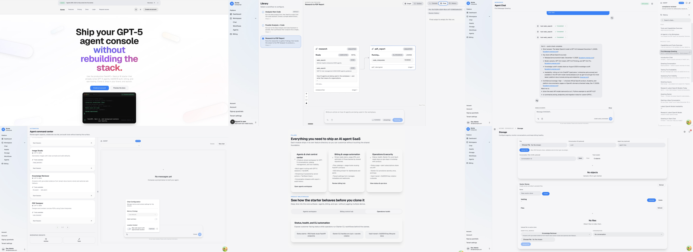

# OpenAI Agent Starter

Production-ready starter kit for building AI Agent SaaS products. The repo bundles a FastAPI backend (OpenAI Agents SDK v0.6.1) and a Next.js 16 frontend, plus an operator-focused Starter CLI that wires secrets, infrastructure, and env files in one flow.



## Architecture At A Glance
- **Backend** (`apps/api-service/`): FastAPI, async SQLAlchemy, Postgres + Redis (refresh tokens & billing), JWT auth, Alembic migrations, Ed25519 keys in `var/keys/`, OpenAI Agents SDK integrations, Stripe billing services.
- **Frontend** (`apps/web-app/`): Next.js 16, TanStack Query, Shadcn UI, HeyAPI-generated client under `lib/api/client`.
- **Starter CLI** (`packages/starter_cli/`): Operator workflows (setup wizard, secrets onboarding, Stripe provisioning, auth tooling, infra helpers) with side-effect-free imports so CI/CD can run `python -m starter_cli.app`.
- **Shared Contracts** (`packages/starter_contracts/`): Versioned provider/storage/secret contracts shared by backend and CLI.
- **Docs & Trackers** (`docs/`): SDK references, frontend UI/data-access guides, CLI milestones, and project trackers.

## API Service Capabilities (FastAPI)
- **Agent specs (declarative)** — Specs live in `apps/api-service/src/app/agents/<key>/spec.py` with Jinja prompts (`prompt.md.j2`). Each spec defines tools, handoffs, outputs, memory defaults, guardrails, and vector-store bindings. Registries materialize specs into concrete OpenAI Agents at runtime.
- **Guardrails (safety + policy)** — Pluggable checks (moderation, jailbreak, PII, hallucination, prompt injection, URL filtering) with presets (`minimal`, `standard`, `strict`, plus tool presets). Agents can apply input/output guardrails and per-tool guardrails; runtime supports streaming or blocking evaluation.
- **Tools** — Explicit tool allowlists per agent. Hosted OpenAI tools (`web_search`, `file_search`, `code_interpreter`, `image_generation`) plus built-ins (`get_current_time`, `search_conversations`), custom function tools, and Hosted MCP tools configured via `MCP_TOOLS`.
- **Workflows** — Deterministic orchestration over agents via `WorkflowSpec` (`apps/api-service/src/app/workflows/<key>/spec.py`), supporting sequential and parallel stages with reducers; workflows reuse agent specs for prompts/tools/guardrails/memory.
- **Vector stores + File Search** — OpenAI Vector Stores integration with per-tenant stores, agent bindings, file attach/search, and request-level overrides. Agent specs choose `tenant_default`, `static`, or `required` bindings.
- **Containers (Code Interpreter)** — Per-tenant container management and agent bindings for OpenAI Code Interpreter. Supports explicit container IDs or auto-managed containers with configurable memory tiers and quotas.
- **Storage + assets** — Tenant-scoped object storage with presigned uploads/downloads, Postgres metadata, and guardrails for MIME/size. Generated assets are tracked separately and linked to conversations/messages.
- **Streaming** — Normalized SSE contract (`public_sse_v1`) for chat + workflow streams, including tool events, reasoning parts, and lifecycle markers for frontend rendering.

## Hosting & Infrastructure Options
- **Compute/runtime** — FastAPI ASGI service + optional worker process. Supports single-instance or multi-replica deployments; billing retry/stream workers can run inline or as a dedicated deployment to avoid double-processing.
- **Datastores** — Postgres (durable state) and Redis (refresh tokens, rate limits, billing streams). Both are first-class in the CLI wizard and health probes.
- **Secrets providers** — Vault (dev/HCP), Infisical (cloud/self-host), AWS Secrets Manager, Azure Key Vault (all wired through the Starter CLI).
- **Object storage providers** — In-memory (dev/test), MinIO/S3-compatible, or Google Cloud Storage (GCS) with presigned upload/download flows.
- **Observability** — JSON logs to stdout or file sink; optional OTLP export via the bundled OpenTelemetry collector or external endpoints.
- **Local dev stack** — Docker Compose helpers for Postgres/Redis/Vault/OTel collector via `just dev-up` and CLI automation.

## Repo Layout (current)
```
justfile                # root orchestrator
ops/                    # compose + observability generator
docs/                   # ADRs, guides, trackers
apps/
  api-service/          # FastAPI backend
  web-app/              # Next.js frontend
packages/
  starter_cli/          # operator CLI
  starter_contracts/    # shared contracts
tools/                  # shared scripts (typecheck, smoke, moduleviz, vault helpers)
var/                    # runtime artifacts (keys, logs, reports) — gitignored
.env.compose(.example)  # docker compose defaults
apps/api-service/.env.local(.example)    # backend service secrets
pnpm-workspace.yaml     # JS/TS workspaces (apps/*, packages/*)
tsconfig.scripts.json   # TS config for repo scripts
```
See `docs/architecture/repo-layout.md` for rules and ownership.

## Quick Command Map (Just)
- `just api` / `just migrate` / `just migration-revision "msg"` – backend serve + migrations (delegates to `api-service/justfile`).
- `just backend-lint | backend-typecheck | backend-test` – backend quality gates.
- `just cli-lint | cli-typecheck | cli-test` – Starter CLI quality gates.
- `just contracts-lint | contracts-typecheck | contracts-test` – contracts package gates.
- `just web-lint | web-typecheck | web-test` – frontend gates (run `pnpm install` first).
- `just dev-up | dev-down | dev-logs | dev-ps` – Postgres/Redis(+otel) via `ops/compose/docker-compose.yml`.
- `just vault-up | vault-down | verify-vault` – local Vault dev signer flows.
- `just cli cmd="..."` – run any CLI command; `just stripe-replay args="list --status failed"` for Stripe tooling.

## Prerequisites
| Tool | Version | Notes |
| --- | --- | --- |
| Python | 3.11+ | Recommended: install via `uv python install 3.11`. |
| Hatch | 1.16+ | Recommended: `uv tool install --python 3.11 hatch` (or `pipx install hatch`). |
| Node.js | 22+ | Paired with `pnpm` for the Next.js app. |
| pnpm | 8+ | `pnpm install` in `apps/web-app/`. |
| just | Latest | Task runner replacing the old Makefile; install via `brew install just` or `sudo apt-get install just`. |
| Docker & Compose v2 | — | Used by Just recipes for Postgres/Redis/Vault. |
| Stripe CLI | — | Required for `starter_cli stripe setup` unless `--skip-stripe-cli`. |

> Tip: macOS users can run `brew install just`; Ubuntu runners can use `sudo apt-get install just`.

## First-Time Setup
1. **Bootstrap tooling**  
   ```bash
   just python-bootstrap   # installs Python 3.11 + Hatch (via uv)
   just bootstrap          # creates/refreshes the Hatch environment
   pnpm install            # inside apps/web-app/
   ```
2. **Create local compose defaults**  
   ```bash
   cp .env.compose.example .env.compose
   ```
   `.env.compose` is gitignored and holds non-sensitive defaults for local helpers (ports, toggles, etc.).
3. **Run prerequisite check**  
   ```bash
   just cli cmd="infra deps --format table"
   ```
4. **Guided environment wizard**  
   ```bash
   python -m starter_cli.app setup wizard --profile local
   # OR from repo root: just cli cmd="setup wizard --profile local"
   ```  
   The wizard writes `apps/api-service/.env.local` (backend) and `apps/web-app/.env.local`, covering secrets, providers, tenants, signup policy, and frontend runtime config. Use `--non-interactive`, `--answers-file`, and `--summary-path` for headless or auditable runs.
5. **Bring up local infrastructure**  
   ```bash
   just dev-up        # Postgres + Redis
   just vault-up      # optional: dev Vault signer for auth flows
   ```
   If you're pointing `DATABASE_URL` at an external Postgres instance for local development, set
   `STARTER_LOCAL_DATABASE_MODE=external` to start Redis (and optional collectors) without starting
   the bundled Postgres container.

## Running The Stack
- **Backend API**  
  ```bash
  just api
  ```  
  Wraps `cd apps/api-service && hatch run serve` with `.env.compose` + `apps/api-service/.env.local`. Use `just migrate` / `just migration-revision message="add_users"` for Alembic workflows.

- **Frontend App**  
  ```bash
  cd apps/web-app
  pnpm dev
  ```
  Env is pulled from `apps/web-app/.env.local`. Follow `docs/frontend/data-access.md` and `docs/frontend/ui/components.md` for feature architecture and Shadcn usage.

## Starter CLI Highlights
All commands run via `cd packages/starter_cli && python -m starter_cli.app …` or repo-root `just cli cmd='…'`.
- `setup wizard` – milestone-based env bootstrap (Secrets → Providers → Observability → Signup → Frontend).
- `secrets onboard` – guided workflows for Vault (dev/HCP), Infisical, AWS Secrets Manager, Azure Key Vault; validates connectivity before emitting env updates.
- `stripe setup` – provisioning for `starter` and `pro` plans, captures webhook + secret keys, can run headless with `--non-interactive`.
- `auth` – service-account token issuance, Ed25519 key rotation, JWKS printing (uses Vault transit when enabled).
- `infra` – wraps `just dev-*` and `just vault-*` plus dependency checks.
- `status` – manages `/api/v1/status` subscriptions/incidents.
- `config dump-schema` – audits every FastAPI setting with env alias, default, type, and wizard coverage.
- `home` / `doctor` – probe-driven health with TUI. Probes are grouped by category (core, secrets, billing) and can be suppressed intentionally via `EXPECT_API_DOWN`, `EXPECT_FRONTEND_DOWN`, `EXPECT_DB_DOWN`, `EXPECT_REDIS_DOWN` (logged once at startup, not shown in the TUI). Services panel collapses when it would duplicate backend/frontend probes; probes remain the source of truth in TUI and JSON/Markdown reports.

Refer to `starter_cli/README.md` for detailed flags, answers-file formats, and contribution rules (imports must stay side-effect free; new env knobs require inventory + tracker updates).

## Automation & Reporting
- `setup wizard` now supports automation toggles (`--auto-infra`, `--auto-secrets`, `--auto-stripe`) plus dependency-aware gating so you can spin up Docker/Redis, manage the local Vault dev signer, and run Stripe provisioning directly from the CLI.
- Every run emits:
  - `var/reports/setup-summary.json` — machine-readable milestone report.
  - `var/reports/cli-one-stop-summary.md` — resume-ready Markdown recap (profile, automation status, verification snapshot).
  - `var/reports/verification-artifacts.json` — append-only ledger of provider verification artifacts (Vault transit probes, AWS/Azure/Infisical checks, Stripe seeding).
- Use these artifacts to prove the environment was bootstrapped correctly (attach the Markdown snippet to onboarding tickets or demos).

## Development Workflow
- Keep FastAPI routers <300 lines; extract shared helpers once reused.
- Redis is dual-use: refresh-token cache and billing event transport. Coordinate settings through the wizard or `apps/api-service/.env.local`.
- Secrets live in `var/keys/`; Vault workflows (`just vault-up`, `just verify-vault`) help issue signed tokens locally.
- Tests are SQLite + fakeredis by default (`conftest.py`); avoid leaking env mutations between tests.
- Backend edits → `cd apps/api-service && hatch run lint` & `hatch run pyright`; frontend edits → `cd apps/web-app && pnpm lint` & `pnpm type-check`.

## Key References
- `starter_cli/README.md` – CLI deep dive, command catalog.
- `SNAPSHOT.md` / `starter_cli/SNAPSHOT.md` – architecture overviews for the repo and CLI.
- `docs/openai-agents-sdk/` – SDK reference + integration patterns.
- `docs/frontend/data-access.md` & `docs/frontend/ui/components.md` – frontend architecture + component inventory.
- `docs/trackers/CLI_MILESTONE.md` – CLI roadmap and status.
- `docs/ops/usage-guardrails-runbook.md` – plan-aware usage guardrails enablement, metrics, and troubleshooting steps.
- `python -m starter_cli.app usage sync-entitlements` – CLI helper that syncs `var/reports/usage-entitlements.json` into `plan_features` so guardrails enforce the latest plan limits.
- `justfile` – curated commands for API, migrations, infra, Stripe tooling, and CLI invocation.

> Future sections can expand on backend internals, service boundaries, and frontend feature guides as they are reviewed. For now, use this README as the top-level map and follow the linked docs for deeper dives.
