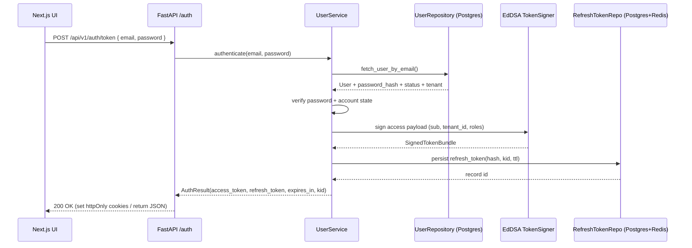
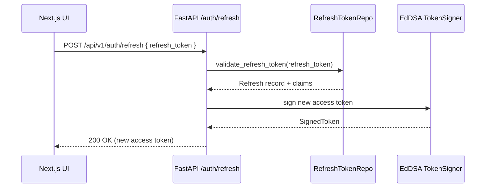

# Milestone: Human Identity Provider Integration

## Objective
- Replace the demo-only `/api/v1/auth/token` flow with a production-ready human login pipeline backed by a persistent identity store.
- Align BE-004 and AUTH-001…AUTH-003 outcomes so FastAPI, Next.js, and downstream services share a single trust contract.
- Leave room to swap in an external IdP later without reworking the domain or API surface.

## Scope & Guardrails
- **In Scope**: User schema + migrations, repository/service layers, API/contract updates, frontend login UX, token issuance + refresh, auditing, rollout plan.
- **Out of Scope**: Observability deep-dive (AUTH-005), production IdP procurement, MFA/UI polish (stubs allowed), billing/tenant policy changes.
- **Design Tenets**: EdDSA-only tokens, hashed credentials with pepper, tenant-aware claims, clean architecture boundaries, test coverage ≥90% for auth-critical modules.

## Sequence Diagrams
### Login + Refresh Token Issuance

### Access Token Refresh

## Tracker Mapping
| New ID | Existing Tracker Alignment | Description |
|--------|----------------------------|-------------|
| IDP-001 | AUTH-001 | Threat model + requirements for human login, lockout, audit, tenancy. |
| IDP-002 | BE-004, DB-001 | User data model + Alembic migrations + seed tooling. |
| IDP-003 | AUTH-003 | Domain/service layer (UserRepository, UserService, AuthService login path). |
| IDP-004 | BE-004 | FastAPI API updates, JWT claim schema, refresh endpoint contracts. |
| IDP-005 | AUTH-003 | Frontend login UX, token handling, storage, sign-out. |
| IDP-006 | AUTH-002/003 | Rollout plan, feature flagging, staging validation, documentation. (Removed) |

## Work Breakdown & Exit Criteria
### IDP-001 — Requirements & Threat Model (AUTH-001)
- **Status:** Completed (2025-11-07) — security reviewed `docs/auth/idp.md` + `docs/security/auth-threat-model.md`; baseline feeds IDP-002…IDP-006 scope.
- Document user lifecycle states (active, disabled, pending, locked) and tenant scoping in `docs/auth/idp.md`.
- Define password policy, login attempt limits, auditing fields, and external IdP swap requirements.
- Capture signed-off acceptance criteria for every downstream ticket.
- **Exit**: Reviewed/approved doc, tracker updated with decisions.

### IDP-002 — Data Model & Migration (BE-004, DB-001)
- **Status:** Completed (2025-11-07) — migration `0e52ba5ab089` applied via `just migrate`; ORM/Pydantic models and the user seeding helper (`python -m starter_cli.app users seed`) merged with docs/env guidance.
- Alembic revision adding `users`, `user_profiles`, `user_login_events`, indexes for email + tenant.
- Seed utility (`starter_cli users seed`) emitting one-time admin credentials.
- SQLAlchemy models + Pydantic schemas for DTOs.
- **Exit**: Migration passes `just migrate` + integration tests; seed script documented.

### IDP-003 — Domain & Service Layer (AUTH-003)
- **Status:** Completed (2025-11-07) — repository/service stack merged with Redis-backed lockouts, bcrypt+pepper hashing, and AuthService login/refresh helpers plus unit/contract coverage.
- Implement `UserRepository` (SQLAlchemy) with CRUD + Redis-backed lockout helpers (tests rely on fakeredis doubles).
- `UserService` handles registration, credential verification, lockout counters (Redis TTL), and emits audit events.
- Extend `AuthService` with `login_user` + refresh helpers reusing EdDSA signer + refresh repo.
- Unit tests covering success/failure paths, bcrypt w/ pepper, lockouts, disabled tenant.
- **Exit**: Tests ≥90% coverage, lint + type checks clean.

### IDP-004 — API & Contract Updates (BE-004)
- **Status:** Completed (2025-11-07) — `/api/v1/auth` login/refresh + `/auth/me` now call the service layer, refresh rotation enforced, and contract suite `tests/contract/test_auth_users.py` green.
- Replace demo credentials in `app/api/v1/auth/router.py` with service-backed login.
- Add `/auth/register` (admin-only), `/auth/password/reset/initiate`, `/auth/password/reset/complete` stubs for future work but wired to validation.
- Ensure responses include `token_type`, `expires_in`, `kid`, `issued_at`, `refresh_expires_in`.
- Update FastAPI dependencies to inject tenant/roles; add RBAC helper for routers.
- Contract tests under `tests/contract/test_auth_users.py` for login, bad password, locked account, refresh, revoked refresh token.
- **Exit**: Contract suite green, OpenAPI regenerated for Next client.

### IDP-005 — Frontend Integration (AUTH-003)
- **Status:** Completed (2025-11-07) — login page, secure cookie/session helpers, middleware guard, silent refresh hook, and Playwright smoke test landed in `web-app`.
- Update `web-app` actions/hooks to call new endpoints, store tokens via secure cookies (`next/headers` middleware) with silent refresh.
- Add sign-in/out components, error states, and protected-route guard using server actions.
- Unit tests for hooks, e2e smoke (Playwright) verifying login + token refresh.
- **Exit**: Frontend build/tests green, UX reviewed with product.

### IDP-006 — Rollout, Docs, & Flagging (AUTH-002/003)
- **Status:** Removed — project now ships only with the real login flow, so dual-mode demo/production rollout work is unnecessary. Keep this noted as a future enhancement if multi-environment deployments re-enter scope.

## Next Steps
1. Archive this milestone once any final doc polish is done, since all scoped work (IDP-001 through IDP-005) is complete.
2. Capture any future rollout needs as separate backlog items if external environments require them later.
